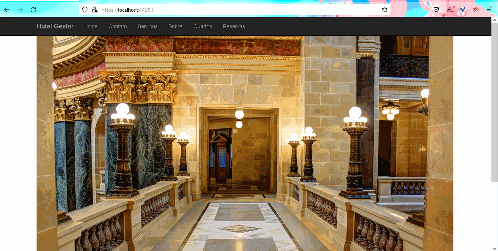

# The Hotel Project
 
 > Sistema de Gerenciamento de hotéis  .netFramework 4.5 MVC + dados SQL Server 

## ✅ Todo 

- [x] Criar banco de dados com tabelas de objetos utilizados no projeto
- [x] Criar diagrama de banco de dados
- [x] Criar barra de navegação
- [x] Criar branding geral do projeto (header, footer, home page)
- [x] Criar View/Controller
  - [x] Quartos
    - [x] Cadastros
    - [x] Teste de gravação banco de dados
    - [ ] Visualizações
  - [ ] Reservas
    - [ ] Cadastro de Usuários
    - [ ] Teste de gravação banco de dados
  - [ ] Limpeza de dados
  - [ ] Deploy
  - [ ] Melhorar o design da aplicação
    - [ ] Criar logomarcas
    - [ ] Definiar paleta de cores

## Demo

### Quartos (Cadastro e visualização)

